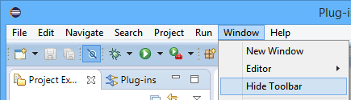
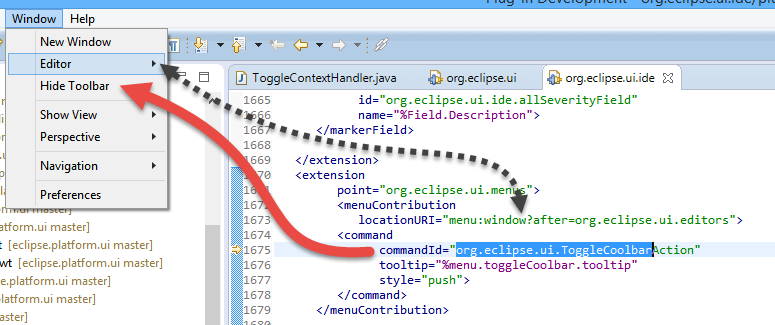
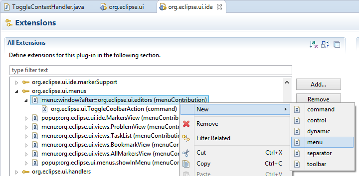
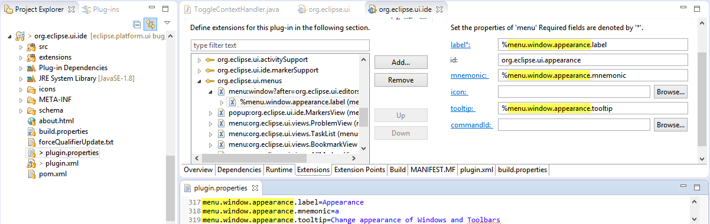
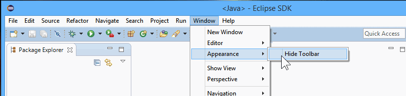

= BugFix - Add Item to Eclipse Menu
Patrik Suzzi <psuzzi@gmail.com>
v1.0, 2015-11-30

_About:_  

This article is about adding a menu item to the existing eclipse menu.
As case study, I'll use https://bugs.eclipse.org/bugs/show_bug.cgi?id=480102[bug 480102]

_Quickrefs_ : https://dev.eclipse.org/mhonarc/lists/eclipse-dev/msg10033.html[mailing]

== https://bugs.eclipse.org/bugs/show_bug.cgi?id=480102[bug 480102], Add appearance menu ..
.Add "Appearance" menu for "Toogle Visibility of Toolbars" and move "Hide Toolbar/ Show toolbar" into it

This is about editing the menu Window > 'Hide Toolbar' Menu Item , and putting it under under a new 'Appearance' menu.

NOTE: Lars, in https://bugs.eclipse.org/bugs/show_bug.cgi?id=480102#c0[480102#comment0] says: Such a menu could also have entries for the "Increase/decrease" font size commands from https://bugs.eclipse.org/bugs/show_bug.cgi?id=476037[Bug 476037].

In my solution I'm just going to add the submenu, as for the _Increase / Decrease_ font I will need the https://bugs.eclipse.org/bugs/show_bug.cgi?id=476037[Bug 476037] is merged.

The menu is defined in org.eclipse.ui.ide/plugin.xml

I edit the menu by switching to _Extensions tab_ .

The edit comprises adding the new menu in the _plugin.xml_, moving the command under the new menu, and adding the externalized strings in the properties file.

At the end, we see the newly created menu, containing the menuitem

