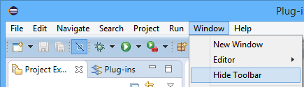
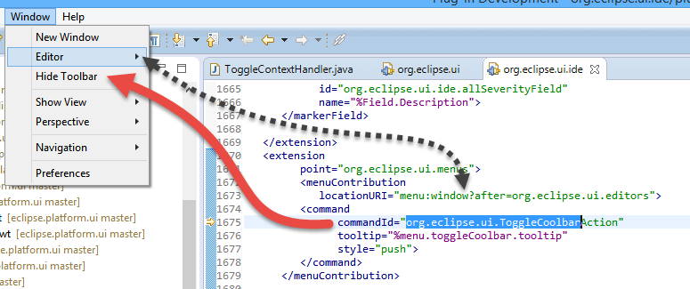
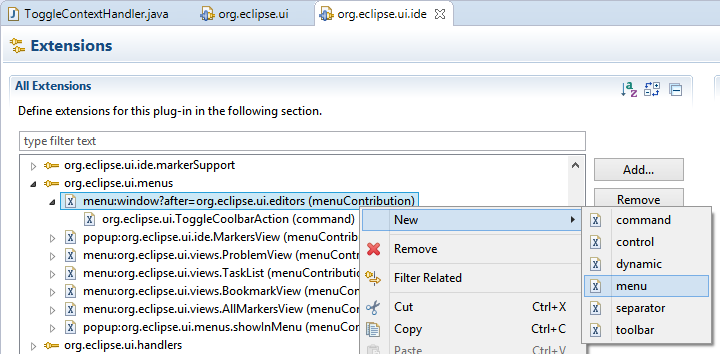
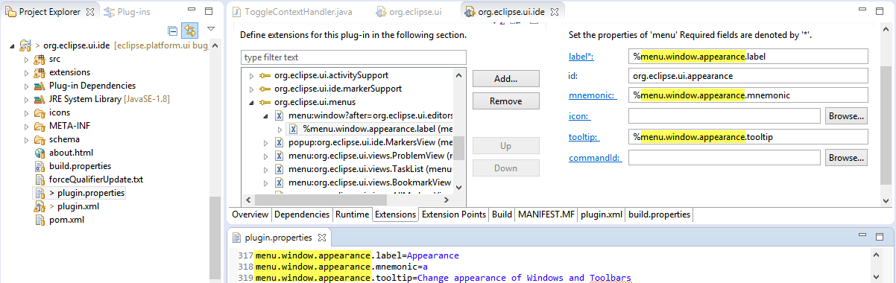
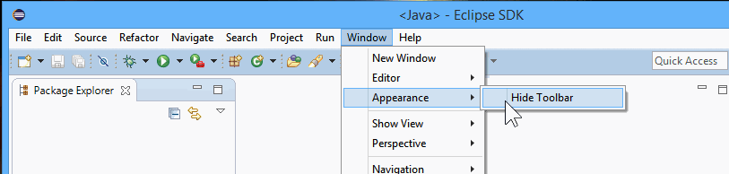

= Platform UI Bugs - 2015/11/30

According https://dev.eclipse.org/mhonarc/lists/eclipse-dev/msg10033.html[this mailing], there are https://bugs.eclipse.org/bugs/report.cgi?x_axis_field=product&y_axis_field=component&z_axis_field=resolution&query_format=report-table&short_desc_type=allwordssubstr&short_desc=&classification=Eclipse&classification=RT&product=Equinox&product=JDT&product=PDE&product=Platform&longdesc_type=allwordssubstr&longdesc=&bug_file_loc_type=allwordssubstr&bug_file_loc=&status_whiteboard_type=allwordssubstr&status_whiteboard=&keywords_type=allwords&keywords=&bug_id=&bug_id_type=anyexact&votes=&votes_type=greaterthaneq&target_milestone=4.6%20M4&target_milestone=Neon%20M4&emailtype1=substring&email1=&emailtype2=substring&email2=&emailtype3=substring&email3=&chfieldvalue=&chfieldfrom=&chfieldto=Now&j_top=AND&f1=noop&o1=noop&v1=&format=table&action=wrap[Over 200 bugs] targeted for M4, and not yet solved.

== https://bugs.eclipse.org/bugs/show_bug.cgi?id=480102[bug 480102]
.Add "Appearance" menu for "Toogle Visibility of Toolsbars" and move "Hide Toolbar/ Show toolbar" into it

This is about editing the menu Window > 'Hide Toolbar' Menu Item , and putting it under under a new 'Appearance' menu.

NOTE: Lars, in https://bugs.eclipse.org/bugs/show_bug.cgi?id=480102#c0[480102#comment0] says: Such a menu could also have entries for the "Increase/decrease" font size commands from https://bugs.eclipse.org/bugs/show_bug.cgi?id=476037[Bug 476037].

In my solution I'm just going to add the submenu, as for the _Increase / Decrease_ font I will need the https://bugs.eclipse.org/bugs/show_bug.cgi?id=476037[Bug 476037] is merged.

The menu is defined in org.eclipse.ui.ide/plugin.xml

I edit the menu by switching to _Extensions tab_ .

The edit comprises adding the new menu in the _plugin.xml_, moving the command under the new menu, and adding the externalized strings in the properties file.

At the end, we see the newly created menu, containing the menuitem

